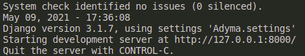

# Projet Adyma :   

#### Développement d'une application web qui aura pour but d'enregistrer et de visualiser des personnes seniors afin de leur proposer des exercices de remise en forme 


## Ce dépôt Git contient :

* L'application web en entier.
* Le Readme permettant l'installation et l'explication de l'application.
* Les dossier Pipfile qui permettent l'installation sur votre machine des éléments nécessaires à l'installation de l'App.


### Installation de l'application :

Pour installer l'application vous devez l'importer sur votre machine puis dans le bon repository lancer la commande suivante :

``` pipenv install ```

puis :

``` pipenv shell ```

qui permettent d'installer l'environnement nécessaire au bon fonctionnement de l'app.


une fois que ces deux commandes sont passées et que vous vous trouvez dans votre environnement virtuel vous pouvez lancer cette commande qui va lancer le serveur

``` python manage.py runserver ``` 

voilà votre serveur est lancé si vous avez ce message d'affiché :



vous pouvez suivre le lien que votre application vous donne et acceder ainsi a votre site.

voilà a quoi il ressemble.


* Le bouton _Bénéficiaire_ servira à accéder à la page qui contient tous les Bénéficiaires
* Les *Formulaires* sont tous à disposition et remplissable si l'on clique dessus.
* Le bouton *Admin* permet d'accéder à l'interface de modification suprême, tout est modifiable depuis cette interface.

###### Pour utiliser l'interface *Admin* il faut au préalable définir un "superuser" via la commande ``` python manage.py createsuperuser ```.

Et voilà, cette application va vous permettre de rentrer vos bénéficiaires en base de donnée, les attacher à un groupe, un établissement et à un coach.
Elle vous permet aussi via l'interface *Admin* de créer un Etablissement, un coach et de le lier à celui là.
